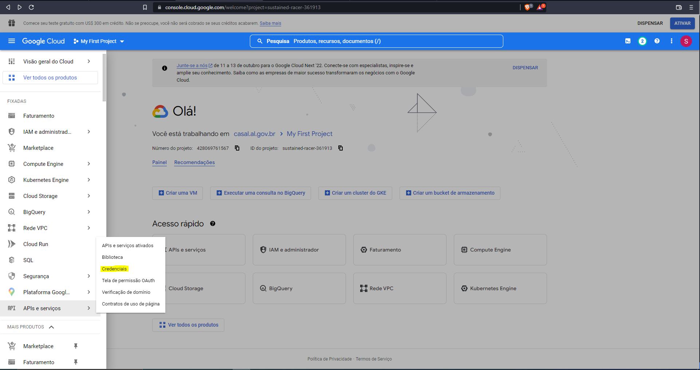
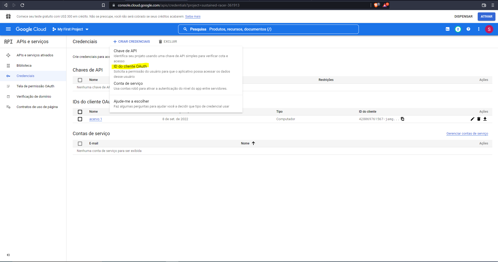
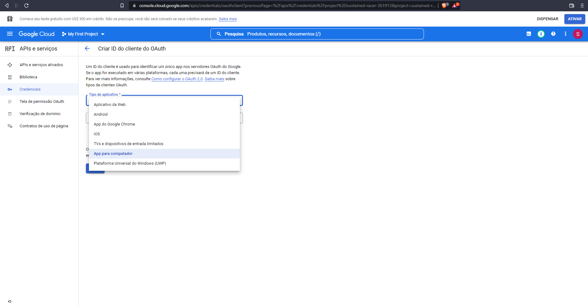
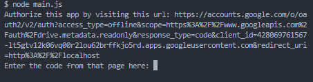
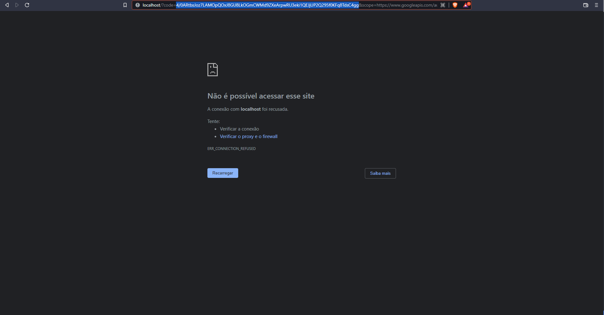
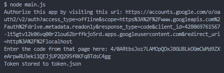

# Google Drive Script

Script para mapear pastas do Google Drive e criar arquivo json contendo os dados para a criação de acervo virtual.

Um servidor com essa finalidade também foi criado. Está disponível [aqui](https://github.com/silviordjr/google-drive-server)

### Tecnologias

Projeto construído com Node.js, fazendo uso das bibliotecas: 

- [Google APIs](https://www.npmjs.com/package/googleapis)

### Autor 

Silvio Ribeiro Dias Jr.

-[LinkedIn](https://www.linkedin.com/in/silvio-dias-junior/)

### Inicialização

Instale as dependências da aplicação;

    npm i

Execute as configurações da Google Drive API conforme seção abaixo;

Execute o script 

    node src/main.js

### Configuração Google Drive API

1. No [console do Google](https://console.cloud.google.com) pesquise por Google Drive API e ative.

2. No [console do Google](https://console.cloud.google.com) procure a opção APIs e serviços e selecione Credenciais; Nas configurações da API escolha clientes externos e como conta teste (em caso em app de teste), a conta do Google Drive que servirá como acervo.

3. Em Credenciais, clique em criar credenciais e em ID do cliente OAuth; 

4. Na área de criação da ID, escolha a opção App para computador e clique em criar. Então, faça o download da credencial gerada e salve na raiz do servidor como credentials.json;

5. Instale o projeto e execute conforme as orientações da seção de inicialização. A mensagem abaixo aparecerá no console. Clique no link e faça login na conta convidada;

6. Copie o codigo gerado conforme imagem abaixo e cole no terminal;

7. O token.json será gerado para a automatização da aplicação e o arquivo data.json será criado.